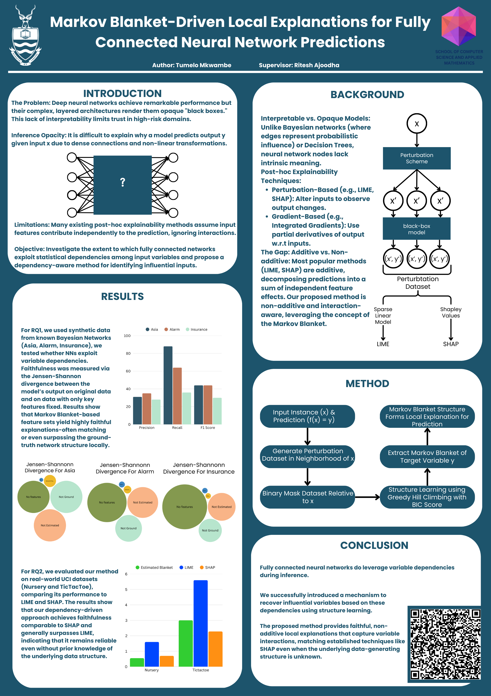

# Honours Research Project



## Setup Instructions

### 1. Setup Environment & Install Dependencies
To create a new Conda environment with Python 3.12:
```bash

### 1. Creates conda environment
make venv

### 2. Activate Conda Environment
conda activate venv

### 3. Install Dependencies (patience required)
make install
